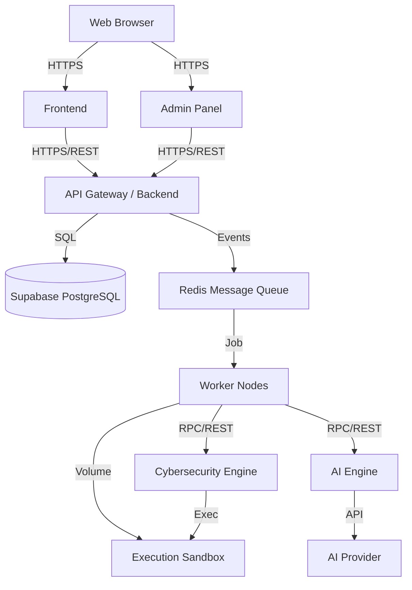

# System Architecture: ForgeFlow AI

## 1. High-Level Architecture Overview

ForgeFlow AI is composed of distinct, decoupled services designed for scalability, security, and independent deployment. The architecture follows a microservices pattern, communicating via REST APIs and asynchronous message queues.

## 2. Core Components

### 2.1 Frontend (Next.js)
- **Role:** Customer-facing portal for managing organizations, uploading projects, viewing migration status, and downloading artifacts.
- **Key Traits:** Strictly UI/UX. No business logic governing subscription enforcement or security.

### 2.2 Backend API (FastAPI)
- **Role:** Central orchestrator. Handles authentication, organization management, subscription enforcement, and job queuing.
- **Key Traits:** Validates all incoming requests, enforces RLS filters before querying Supabase, orchestrates the state machine for migration jobs.

### 2.3 Supabase (PostgreSQL & Storage)
- **Role:** Primary source of truth.
- **Key Traits:** Enforces Row Level Security (RLS) on all tenant tables. Stores structured data and manages secure object storage for uploaded ZIPs and generated artifacts.

### 2.4 Worker Nodes (Python / Celery or RQ)
- **Role:** Asynchronous job execution.
- **Key Traits:** Polls the queue, downloads the source ZIP, triggers the Sandbox, and coordinates the pipeline between the AI Engine and Cyber Engine.

### 2.5 Execution Sandbox (gVisor / Firecracker)
- **Role:** Isolated environment for extracting hostile ZIPs, running deterministic parsers, executing builds, and running tests.
- **Key Traits:** No network egress (except explicitly whitelisted destinations), dropped Linux capabilities, strict CPU/Memory limits.

### 2.6 AI Engine (Python)
- **Role:** Analyzes the AIR, generates migration plans, and produces Flutter source code.
- **Key Traits:** Abstracted from the specific LLM provider. Focuses on prompt construction, schema validation, and context management (preventing prompt injection).

### 2.7 Cybersecurity Engine
- **Role:** Executes static analysis, dependency checks, and secret scanning on both the source web app and the generated Flutter app.
- **Key Traits:** Wraps tools like Semgrep and OSV-Scanner, producing standardized security reports mapped to OWASP categories.

### 2.8 Admin Panel (Next.js)
- **Role:** Internal tool for platform operators to monitor system health, manage users, and review flagged security events.
- **Key Traits:** Completely separate application deployed internally. Uses separate authentication roles.

## 3. Data Flow: Migration Pipeline

1. **Upload:** User uploads a ZIP via the Frontend. The ZIP is stored securely in Supabase Storage.
2. **Queue:** Backend creates a `MigrationJob` record (`Status: QUEUED`) and pushes an event to Redis.
3. **Ingest:** A Worker picks up the job, provisions a Sandbox, and extracts the ZIP inside the Sandbox.
4. **Analyze:** Worker triggers deterministic parsers in the Sandbox to extract routes, dependencies, and AST data.
5. **Security 1:** Cyber Engine scans the source code for secrets and vulnerabilities.
6. **AIR Generation:** The extracted data is compiled into the Application Intermediate Representation (AIR).
7. **Plan & Generate:** The AIR is sent to the AI Engine to plan the Flutter architecture and generate code.
8. **Build & Test:** Generated code is injected back into a Sandbox to run `flutter build` and unit tests.
9. **Security 2:** Cyber Engine scans the generated Flutter code.
10. **Finalize:** If validation passes, artifacts are uploaded to Supabase Storage, and the job is marked `COMPLETED`. If validation fails, the job enters the Remediation loop (up to `MAX_RETRIES`).
